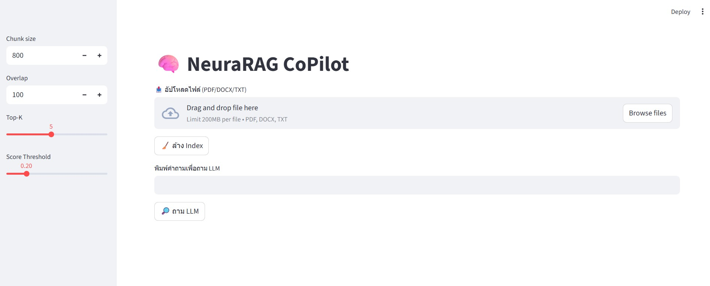

# 🧠 RAG-LITE Collection

โปรเจกต์นี้รวมสองระบบ RAG ที่ใช้ **Streamlit**, **FAISS**, และ **OpenRouter LLM**  
เพื่อสาธิตการค้นหาและสรุปข้อมูลเอกสารด้วย AI

---

## 📂 Projects
1. **NeuraRAG CoPilot (`neuraRag.py`)**  
   - ระบบ RAG สำหรับเอกสารองค์กร  
   - ฟีเจอร์ **Human-in-the-Loop**: Preview และอนุมัติ chunk ก่อนสร้าง Index  
   - ปุ่มล้าง Index และปรับ Top-K, Threshold ได้เอง  

2. **TalentRAG (`talentRag.py`)**  
   - ระบบค้นหาและจับคู่ Resume ตามทักษะ  
   - รองรับการอัปโหลด Resume หลายไฟล์  
   - ปรับ Top-K และ Score Threshold เพื่อหาผู้สมัครที่ตรงความต้องการ  

---

## 🚀 Setup
1. **Clone Repo**
   ```bash
   git clone https://github.com/USERNAME/RAG-LITE.git
   cd RAG-LITE


